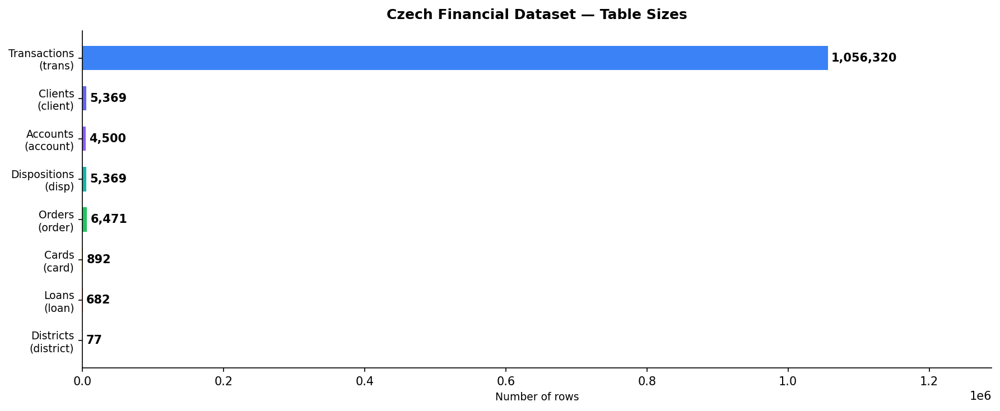
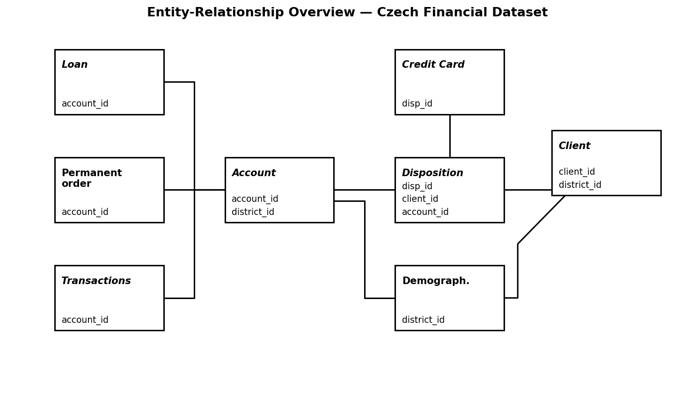
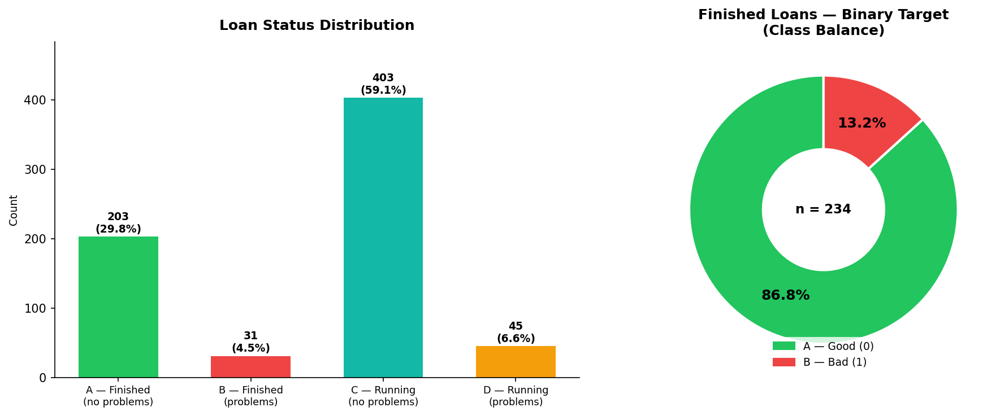
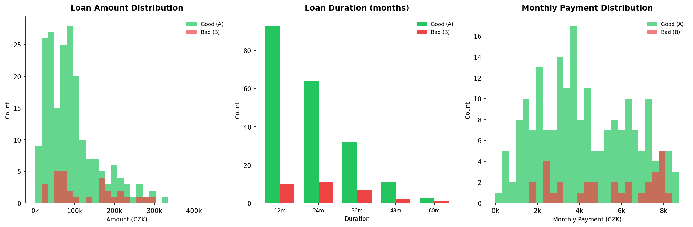
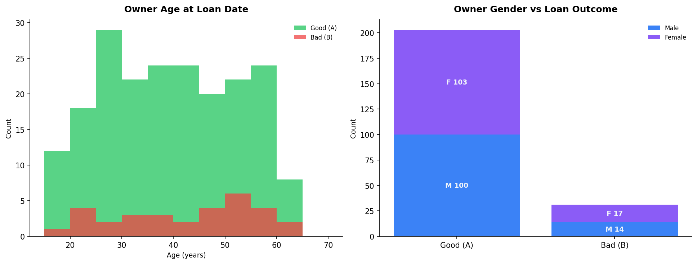
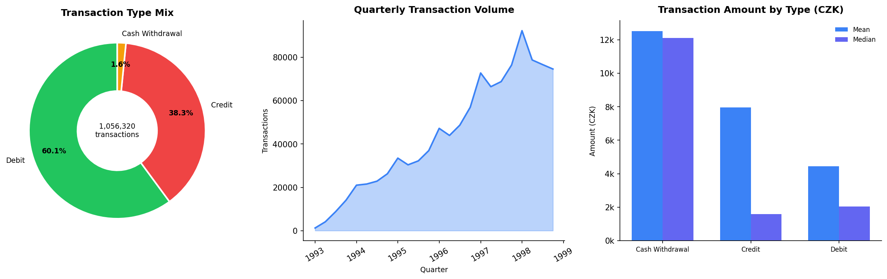
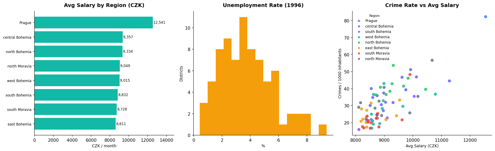
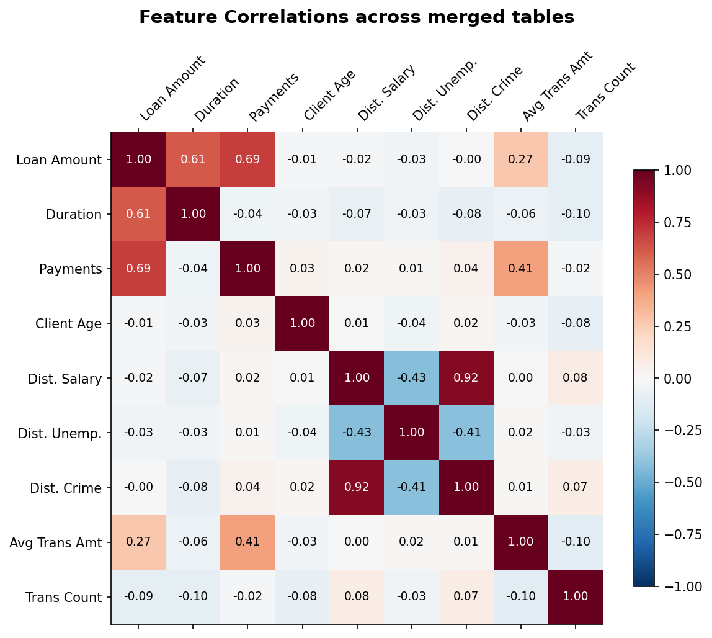

## 1. Where does this dataset come from?

::: {.columns}
::: {.column width="50%"}
**Czech Financial Dataset (Berka, PKDD'99)**

- Real Czech bank data, 1993–1998
- Published for PKDD '99 challenge
- Relational structure (not a flat CSV)

**The core business problem:**
Predict which loan applicants will default — using only the information available *at the time the loan is approved*.
:::

::: {.column width="50%"}
**Table sizes**

:::
:::

::: {.notes}
Start by grounding the audience. This is not a toy dataset — it is messy, relational, real-world banking data from the 1990s. The challenge is not just the modelling, it is the entire pipeline from raw tables to a model-ready matrix.
:::

## 2. Eight tables, one question

::: {.notes}
This diagram shows why pre-processing is the hardest part. The data is fragmented across 8 tables. Every feature we want to feed the classifier has to be assembled by joining tables and aggregating. The loan table has only 682 rows — that is our model's training set.
:::

## 3. A peek at the raw data {.smaller}

What do these tables actually look like before we process them?

**The `loan` table** (Target and contract terms)

| loan_id | account_id | date | amount | duration | payments | status |
|:---|:---|:---|:---|:---|:---|:---|
| *Numeric* | *Numeric* | *Date (YYMMDD)* | *Numeric* | *Numeric* | *Numeric* | *Categorical* |
| 5314 | 1 | 930105 | 96396 | 12 | 8033 | B |
| 5316 | 2 | 930226 | 165960 | 36 | 4610 | A |

 

**The `trans` table** (Financial behaviour)

| trans_id | account_id | date | type | amount | balance | ... |
|:---|:---|:---|:---|:---|:---|:---|
| *Numeric* | *Numeric* | *Date* | *Categorical* | *Numeric* | *Numeric* | ... |
| 695247 | 1 | 930101 | PRIJEM | 1000 | 1000 | ... |
| 171812 | 2 | 930101 | PRIJEM | 1100 | 1100 | ... |

::: {.notes}
We need to give an example of the actual data to show attribute types and meanings. The transaction table has over a million rows like this, with cryptic Czech categories (PRIJEM = credit). We have to translate and aggregate these.
:::

## 4. What are we predicting?

::: {.columns}
::: {.column width="50%"}
The **loan table** contains a `status` column:

| Status | Meaning | Target |
|---|---|:---:|
| **A** | Finished · no problems | ✅ **0** |
| **B** | Finished · with problems | ✅ **1** |
| C | Running · no problems | ❌ |
| D | Running · problems | ❌ |

**Why only A and B?**
C and D have not concluded yet. The cleanest experiment uses only **finished contracts**.
:::

::: {.column width="50%"}

:::
:::

::: {.notes}
This is the most important slide conceptually. The business question is well-defined but the dataset is imbalanced — only 31 loans are class 1 (bad). This immediately tells the classifier designer they cannot use raw accuracy as a metric.
:::

## 4. Loan characteristics

Distributions overlap significantly. Loan amount and duration alone cannot separate good from bad. We need richer signals from **transactions** and **demographics**.

::: {.notes}
This is the key motivating slide for feature engineering. If the loan contract terms alone could perfectly separate good from bad, we wouldn't need transactions or demographics. The overlap here is the argument for why a rich feature matrix matters.
:::

## 5. Client demographics

- Age ranges broadly (20–70); median is similar for good/bad loans.
- Gender split is roughly 50/50 for both outcomes.
- We keep demographics as baseline features, but rely more on behaviour.

::: {.notes}
Demographics set the context — they describe who the client is. But they're not sufficient on their own. The critical insight is that demographic features interact with behavioural features (transactions).
:::

## 6. Transaction patterns

- 1M+ rows aggregated into per-loan **summary statistics**.
- Accounts accumulate **months or years** of history before the loan.
- Cash-flow and spending behaviour are highly predictive.

::: {.notes}
Transactions are the most data-rich part of the dataset. 1M rows condensed into a handful of summary statistics per loan. Mention that how we aggregate is one of the main feature engineering decisions in Part 2.
:::

## 8. Geographic context

A loan in an urban, high-salary region (like Prague) carries different background risk than a loan in a high-unemployment rural district. We use these as **macroeconomic features**.

::: {.notes}
Geography is a proxy for economic context that the bank cannot control. A client in a struggling district may face job loss and default even if they were a responsible borrower. These features give the classifier macroeconomic context.
:::

## 9. Feature Correlations

When we temporarily join the numerical columns together, we see:
- **Loan Amount** and **Payments** are highly correlated (as expected).
- **Crime Rate** and **Salary** are positively correlated (urban effect).
- **Client Age** has almost zero linear correlation with loan terms.

::: {.notes}
This heatmap confirms our hypothesis: the tables capture distinct dimensions of a client's profile. We need all these dimensions to train an effective classifier.
:::

## 10. The Preprocessing Challenge

Transforming these 8 relational tables into a predictive model requires solving two major hurdles:

**1. Data Aggregation**
How do we condense 1,000,000+ individual transactions and daily balances into a single row of features for one loan?

**2. Strict Temporal Cutoffs (Data Leakage)**
When predicting default, we can only use information the bank knew *at the time the loan was signed*. Any transactions or card issuances that happened after the `loan_date` must be strictly filtered out to prevent "cheating."

::: {.notes}
This slide perfectly bridges your section into Part 2. Instead of a complex graph, it just states the problem: we have a lot of data, we need to flatten it, and we have to be extremely careful not to use future information.
:::

